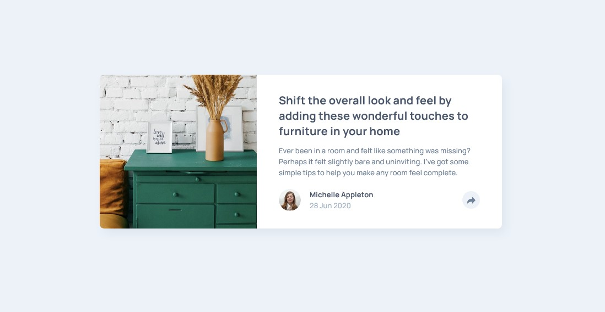
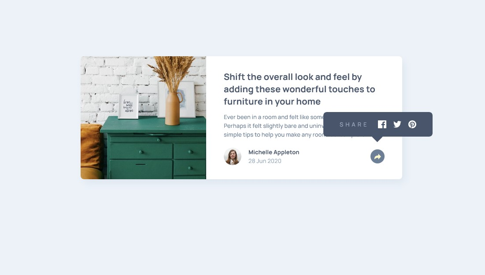
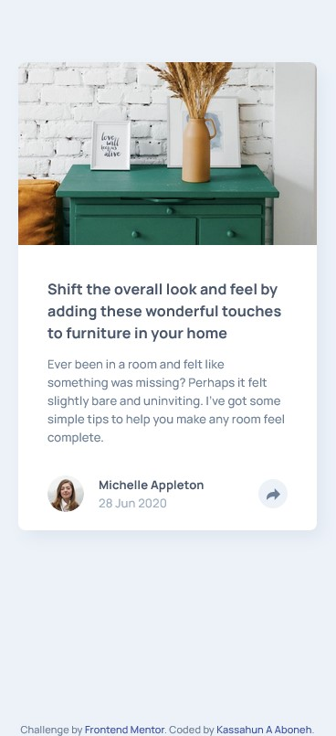
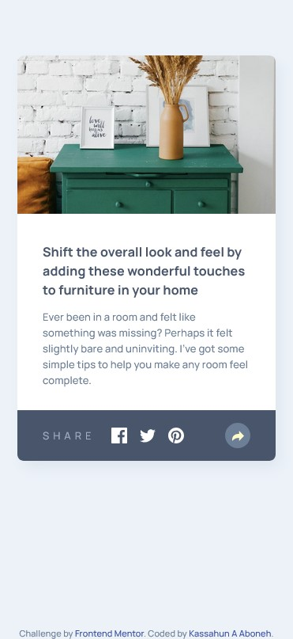

# Frontend Mentor - Article preview component solution

This is a solution to the [Article preview component challenge on Frontend Mentor](https://www.frontendmentor.io/challenges/article-preview-component-dYBN_pYFT). Frontend Mentor challenges help you improve your coding skills by building realistic projects. 

## Table of contents

- [Overview](#overview)
  - [The challenge](#the-challenge)
  - [Screenshot](#screenshot)
  - [Links](#links)
- [My process](#my-process)
  - [Built with](#built-with)
  - [What I learned](#what-i-learned)
  - [Continued development](#continued-development)
- [Author](#author)

## Overview

### The challenge

Users should be able to:

- View the optimal layout for the component depending on their device's screen size
- See the social media share links when they click the share icon

### Screenshot

### Links

- Solution URL: [https://github.com/kassahunAmdie/article-preview-component-master](https://your-solution-url.com)
- Live Site URL: [https://kassahunamdie.github.io/article-preview-component-master/](https://your-live-site-url.com)

## My process

### Built with

- Semantic HTML5 markup
- CSS custom properties
- Flexbox
- CSS Grid
- Mobile-first workflow

### What I learned

New thing I included here is the use of 'sass'. I have lightly dabbled with it in the past but this time I delved deeper into learning and implementing it. Resources I used are https://www.youtube.com/watch?v=owpTAMP7gD8&t=2s funny coder for a beautiful introduction on how I can benifit from using sass. Then a deeper dive with coder coder's instructional video at https://www.youtube.com/watch?v=jfMHA8SqUL4&t=3000s. Finally I went to the source to solidify my understanding at https://sass-lang.com/documentation/.  

### Continued development

I want to continue to work on sass, having seen how much it helps with organizing and working through the styling process. There is still so much I can learn.

## Author

- Website - [Coming soon](https://www.your-site.com)
- Frontend Mentor - [@kassahunAmdie](https://www.frontendmentor.io/profile/yourusername)

